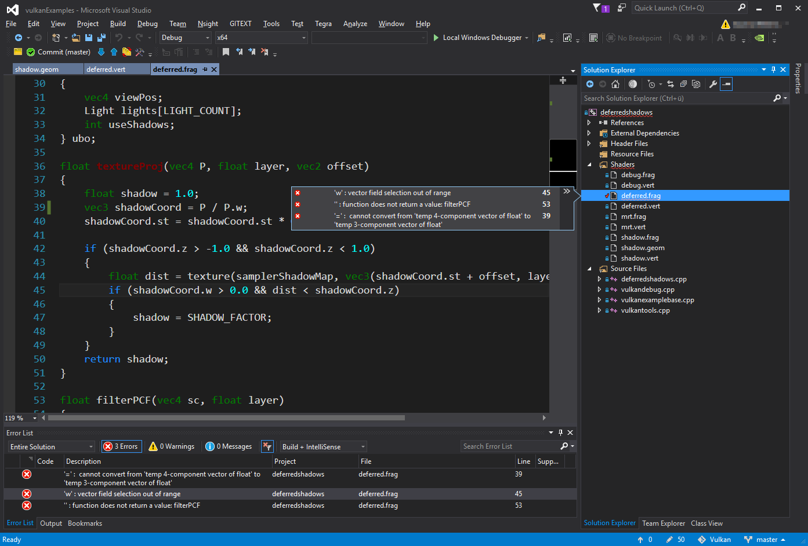
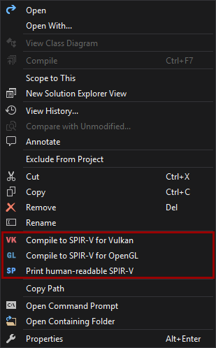
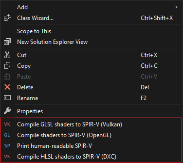
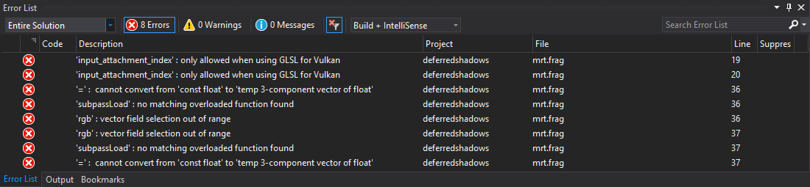

# SPIR-V extension for Visual Studio (VSIX)

## About



This VSIX extension adds SPIR-V related commands to the context menu of GLSL shader files (and folders containing shaders) for invoking the GLSL reference compiler from inside the IDE.

## Requirements

### GLSL standalone reference compiler
The extension requires a version of the glslang reference compiler to be in your path that supports SPIR-V:

- Built from the sources at [https://github.com/KhronosGroup/glslang](https://github.com/KhronosGroup/glslang)
- Install the [LunartG Vulkan SDK](https://vulkan.lunarg.com/) (comes with a pre-built version)

The extension will search for the ```glslangvalidator.exe``` using the paths from the following environment variables: ```PATH```, ```VK_SDK_PATH``` and ```VULKAN_SDK``` (set by the LunarG SDK)

### Supported Visual Studio versions
The extension supports all editions of **Visual Studio 2015, 2017 and 2019**.

## Installation

The extension is available at the [Visual Studio Marketplace](https://marketplace.visualstudio.com/items?itemName=SaschaWillems.SPIRV-VSExtension) and can be installed directly from the IDE.

## New context menu entries



The context menu entries will be displayed if the current file selection or folder includes at least one shader file with a file extension supported by the GLSL reference compiler:
- ```.vert``` (Vertex shader)
- ```.tesc``` (Tessellation control shader)
- ```.tese``` (Tessellation evaluation shader)
- ```.geom``` (Geometry shader)
- ```.frag``` (Fragment shader)
- ```.comp``` (Compute shader)
- ```.mesh``` (Mesh shader)
- ```.task``` (Task shader)
- ```.rgen``` (Ray generation shader)
- ```.rint``` (Ray intersection shader)
- ```.rahit``` (Ray any hit shader)
- ```.rchit``` (Ray closest hit shader)
- ```.rmiss``` (Ray miss shader)
- ```.rcall``` (Ray callable shader)

These are currently fixed, but future versions may add an options pane to adjust file extensions and how they are treated.

## Features

### SPIR-V functions

#### Compile to SPIR-V (Vulkan semantics)
Compile all selected shader files to SPIR-V binary using Vulkan semantics (-V) and output to ```"filename"."stage".spv```.

#### Compile to SPIR-V (OpenGL semantics)
Compile all selected shader files to SPIR-V binary using OpenGL semantics (-G) and output to ```"filename"."stage".spv```. 

**Note:** SPIR-V for OpenGL is supported with the [```GL_ARB_gl_spirv```](https://www.opengl.org/registry/specs/ARB/gl_spirv.txt) extension and implemented as a binary shader format. 

A C++ example for loading a binary SPIR-V shader with OpenGL [can be found here](https://github.com/SaschaWillems/openglcpp/tree/master/SPIRVShader).

#### Print human-readable SPIR-V

This will output human readable SPIR-V (-H) using Vulkan semantics and displays it in a new document window.

### Error list



Compile errors are added to the error list of Visual Studio and work like regular compile errors. Double clicking on an error will open that shader and jump to the line that the error has occured.

## Todo
This is a very early version of this extension, some of the planned features are:
- Extension settings pane
  - Add file extension mappings
  - Custom binary SPIR-V output file name scheme (instead of a fixed output file scheme)
  - Option to disable dialog boxes after compile
  - Option to use a remapper (SPIR-V remap etc.)
- Save to text as hexadecimal numbers (-x)
  - Generate include headers
- Language features (as soon as their support by the reference compiler is finished)
  - Multiple main entry points
  - Compile from HLSL

Issues and pull request for additional features are welcome :)